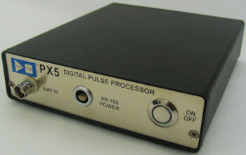

# Amptek PX5

This library provides an interface to control the [Amptek PX5 Digital Pulse Processor (DPP) & MCA](https://www.amptek.com/products/digital-pulse-processors/px5-digital-pulse-processor).

It is implemented based on the official specifications found in the Amptek [Digital Products Programmer's Guide](https://www.amptek.com/-/media/ametekamptek/documents/resources/products/user-manuals/amptek-digital-products-programmers-guide-b3.pdf?la=en&revision=70db147d-b3c2-4d44-aaa2-374f648a4bc7). A copy of this guide is included in this repository for convenience.

**Note:** While the Programmer's Guide covers multiple Amptek devices, this library has only been tested with the **PX5** model. Compatibility with other models mentioned in the guide is not guaranteed.



# Getting Started

1.  Install the `cfis_interfaces` package:
    ```bash
    pip install git+https://github.com/CFIS-UFRO/cfis-interfaces.git
    ```
2.  Import the library in your Python script:
    ```python
    from cfis_interfaces import AmptekPX5
    ```
3. Create an instance of the `AmptekPX5` class:
    ```python
    px5 = AmptekPX5()
    ```
4. Use the built-in method to install the `libusb` dependency (if it is already installed, the method will do nothing):
    ```python
    px5.install_libusb()
    ```
5. On Linux, probably you will want to add a udev rule to allow non-root access to the PX5 device:
    ```python
    px5.add_udev_rule()
    ```